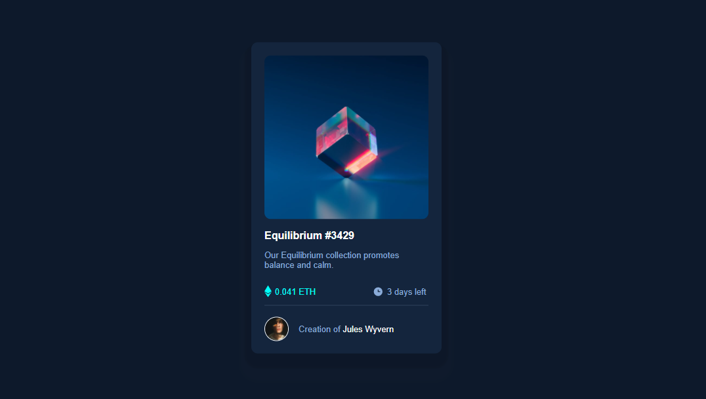

# Frontend Mentor - NFT preview card component solution

This is a solution to the [NFT preview card component challenge on Frontend Mentor](https://www.frontendmentor.io/challenges/nft-preview-card-component-SbdUL_w0U). Frontend Mentor challenges help you improve your coding skills by building realistic projects. 

## Table of contents

  - [Overview](#overview)
  - [The challenge](#the-challenge)
  - [Screenshot](#screenshot)
  - [My process](#my-process)
  - [Built with](#built-with)
  - [What I learned](#what-i-learned)
  - [Continued development](#continued-development)
  - [Useful resources](#useful-resources)

## Overview

NFT preview card component coding challenge on front end mentor is completed using HTML/CSS. This is a good challenge to practice and improve my skills.

### The challenge

Users should be able to:

- View the optimal layout depending on their device's screen size
- See hover states for interactive elements

### Screenshot

## My process

It took me more than six hours to complete this project in three days. At first, I worked on HTML and then started CSS after giving a simple style I did alignments using flexbox which was a bit of a challenge. I am new to web design facing the obstacles and overcoming them while learning in this project was fun. 

### Built with

- HTML
- CSS custom properties
- Flexbox
- CSS variables
- Mobile-first workflow

### What I learned

I applied flexbox concepts, CSS variables, and "before" pseudo-element in this project which is my first time using those concepts in my project practice, and gained a good understanding of those concepts.

### Continued development

Adding active state to the image without affecting the icon view's opacity was challenging even though I knew the concepts I had trouble applying them in the context of this project I managed to get it done but still does not feel confident about that part so I have to work on that in future. 

### Useful resources

- [How to make a background-image transparent in CSS](https://youtu.be/LQsjNmkqUOc) -  This video helped me solve the problem I had in changing the background opacity without affecting the child items. I used this concept to create the active state in the image. 

